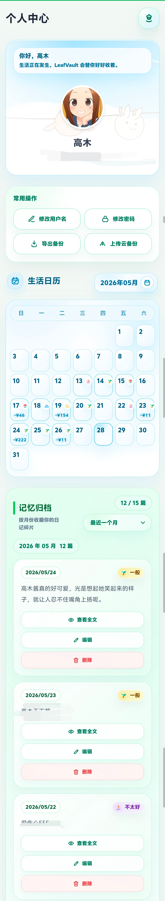
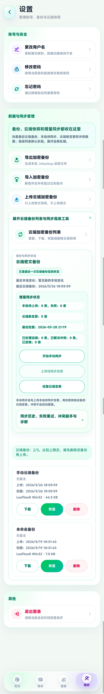
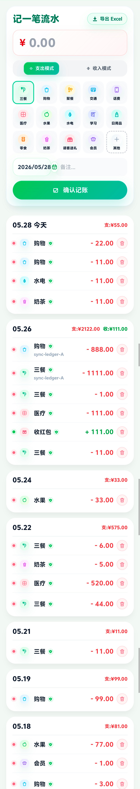
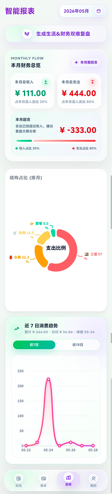
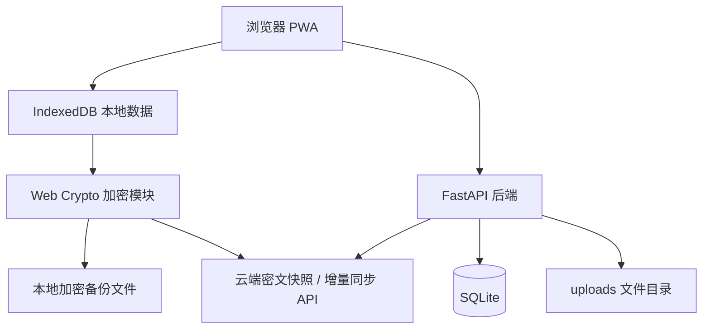

# LeafVault

一个本地优先、重视隐私和加密备份的个人生活记录 PWA。

## 项目简介

LeafVault 是一个 v0.1 展示阶段的个人生活管理 Web 应用，聚焦日记、图片、心情、账本、生活日历、本地加密备份、云端密文快照和手动增量同步。

它尽量让用户在本地浏览器中完成日常记录，再通过加密导出、云端密文快照和可控的同步流程保护长期数据。

> 当前仍处于持续迭代阶段。

---

## 项目亮点

- **本地优先**：日记、账本和同步队列优先围绕浏览器 IndexedDB 工作。
- **PWA 类 App 体验**：支持 Manifest、Service Worker、离线提示和更新提示。
- **游客本地 Demo**：未登录也能体验核心功能，Demo 数据只保存在当前浏览器。
- **加密备份**：本地导出和云端快照使用用户输入的备份密码在前端加密。
- **密文云端存储**：云端快照和增量同步保存密文 payload，列表接口只返回元数据。
- **手动增量同步**：支持变更上传、云端变更检查、合并建议、冲突副本和手动解决。
- **安全登录基线**：支持 Cookie 优先登录态、HttpOnly Cookie、CSRF 校验和 Bearer fallback 兼容。
- **Docker 自托管**：提供 Dockerfile、docker-compose.yml、docker-compose.prod.yml、.env.example、.env.production.example 和部署说明。
- **质量门禁**：集成 pytest、前端静态检查、安全检查、PWA 检查、Docker 检查和 JS 语法检查。

---

## 界面预览

| 首页 / 日记 | 生活日历 | 数据与同步 |
| --- | --- | --- |
|  |  |  |

| 记账功能 | 报表统计 |
| --- | --- |
|  |  |

---

## 核心功能

### 日记记录

- 文本日记、图片附件和心情记录。
- 支持当日日记补充更新，多张图片追加保存。
- 首页卡片支持只读沉浸式预览，阅读与编辑动作分离。

### 账本记录

- 收入 / 支出记录。
- 分类统计、月度汇总和消费结构图。
- 统计接口按当前用户隔离数据。

### 生活日历

- 按日期查看日记、心情和收支摘要。
- 移动端优化日期、心情和支出金额的可读性。

### 游客本地 Demo 模式

LeafVault 支持游客本地 Demo 模式，用于公开展示或快速试用。

未登录用户可以点击“体验 Demo”进入应用。Demo 数据仅保存在当前浏览器 IndexedDB 中，不会上传到服务器，也不会混入正式账号数据。

Demo 模式可以体验：

- 写日记
- 添加本地图片
- 记账
- 生活日历
- 统计
- 本地加密导出和导入

以下功能需要正式账号：

- 云端备份
- 多设备同步
- AI 润色
- 修改用户名
- 修改密码

Demo 下会用温和提示拦截这些云端功能，不会发起真实云端请求。更多说明见 [Demo 模式说明](docs/DEMO_MODE.md)。

### 本地加密备份

- 导出 `.lvbackup` 加密备份。
- 通过用户自定义备份密码导入恢复。
- 备份密码不保存到 localStorage、sessionStorage 或 IndexedDB。

### 云端密文备份

- 上传、下载、恢复、删除云端密文快照。
- 支持快照名称和备注，方便管理。
- 云端备份列表不返回 `encrypted_blob`。

### 增量同步

- 本地记录 `local_changes` 变更日志。
- 手动上传加密后的 `encrypted_change`。
- 支持云端增量元数据拉取、单条解密预览、合并前检查、安全应用、冲突副本、冲突手动解决和同步历史。
- 当前不做后台自动同步，也不会自动覆盖冲突数据。

### 安全登录

- JWT 身份以 `user_id` 为主体。
- 支持 HttpOnly access token Cookie。
- Cookie 模式写请求启用 CSRF Cookie + `X-CSRF-Token` 校验。
- Bearer token 和 localStorage token 仍作为 v0.1 迁移兼容路径保留。

---

## 技术栈

| 层级 | 技术 |
|---|---|
| 前端 | HTML / Tailwind CSS / Vanilla JavaScript |
| 本地存储 | IndexedDB |
| 加密能力 | Web Crypto API |
| 后端 | FastAPI |
| 数据库 | SQLite |
| 认证 | JWT / HttpOnly Cookie / CSRF |
| PWA | Service Worker / Manifest |
| 部署 | Docker / Docker Compose |

---

## 架构概览



更完整的数据流、同步模型和部署结构见 [架构说明](docs/ARCHITECTURE.md)。

---

## 安全边界说明

LeafVault 重视隐私和安全，但 v0.1 阶段不应被理解为完整零知识系统。

当前安全边界如下：

- 日记和账本的日常工作空间优先围绕浏览器 IndexedDB。
- 本地备份由用户输入密码派生密钥，再通过 Web Crypto API 在浏览器端加密。
- 登录态支持 Cookie 优先；Cookie 模式写请求启用 CSRF 校验
- 上传图片文件不等同于端到端加密内容，服务器和部署环境仍需要可信保护。

更多安全策略和后续加固计划见 [生产环境安全加固说明](docs/SECURITY_HARDENING.md)。

---

## 快速开始

以下命令面向 Windows PowerShell，本地开发不要求 Docker。

```powershell
python -m venv .venv
.\.venv\Scripts\activate

pip install -r requirements.txt
npm install

Copy-Item .env.example .env
# 打开 .env，至少确认 SECRET_KEY、DATABASE_PATH、UPLOAD_DIR 等配置

npm run build
python -m uvicorn main:app --host 127.0.0.1 --port 8000
```

打开：

```text
http://127.0.0.1:8000/
```

如果需要同一局域网手机访问：

```powershell
python -m uvicorn main:app --host 0.0.0.0 --port 8000
```

然后在手机浏览器访问电脑的局域网 IPv4 地址，例如：

```text
http://你的电脑IPv4:8000/
```

---

## 环境变量

项目会读取 `.env`。请从 `.env.example` 复制模板，不要提交真实 `.env`。

```powershell
Copy-Item .env.example .env
```

常用变量如下，完整配置以 `.env.example` 为准。

| 变量 | 说明 |
|---|---|
| `SECRET_KEY` | JWT 签名密钥，生产环境必须改成长随机字符串 |
| `ACCESS_TOKEN_EXPIRE_DAYS` | 登录 token 有效天数 |
| `DATABASE_PATH` | SQLite 数据库路径 |
| `UPLOAD_DIR` | 用户上传图片目录 |
| `ENVIRONMENT` | `development` / `testing` / `production` |
| `DEPLOYMENT_MODE` | 部署模式：`local` 本地开发 / `lan` 局域网或本地 Docker 测试 / `public` 公网生产 |
| `PUBLIC_BASE_URL` | 公网访问地址，生产环境应为 HTTPS |
| `ALLOWED_ORIGINS` | CORS 白名单，生产环境不要使用 `*` |
| `TRUSTED_HOSTS` | 可信 Host 白名单，生产环境不要使用 `*` |
| `REGISTRATION_MODE` | 注册模式：`open` / `invite` / `closed` |
| `REGISTRATION_INVITE_CODE` | 邀请码注册模式下的注册邀请码，禁止写入公开文档或截图 |
| `AUTH_TOKEN_TRANSPORT` | 认证传输方式，例如 `bearer` / `cookie` / `dual` |
| `AUTH_PREFER_COOKIE` | 是否优先使用 Cookie 登录态 |
| `AUTH_STORE_TOKEN_IN_LOCALSTORAGE` | 是否将 token 存入 localStorage，生产环境建议关闭 |
| `AUTH_ALLOW_BEARER_FALLBACK` | 是否保留 Bearer fallback 兼容路径 |
| `AUTH_COOKIE_NAME` | 登录 Cookie 名称 |
| `COOKIE_SECURE` | Cookie 是否只允许 HTTPS，生产环境应为 `true` |
| `COOKIE_SAMESITE` | Cookie SameSite 策略：`lax` / `strict` / `none` |
| `COOKIE_MAX_AGE_SECONDS` | Cookie 有效期 |
| `CSRF_COOKIE_NAME` | CSRF Cookie 名称 |
| `CSRF_HEADER_NAME` | CSRF 请求头名称，默认通常为 `X-CSRF-Token` |
| `CSRF_PROTECTION_ENABLED` | 是否启用 CSRF 防护 |
| `CSRF_ENFORCE_FOR_COOKIE_AUTH` | Cookie 写请求是否强制 CSRF 校验 |
| `CSP_MODE` | CSP 安全策略模式，生产环境必须明确配置 |
| `MAX_UPLOAD_SIZE_MB` | 单个上传文件大小限制 |
| `MAX_CLOUD_SNAPSHOT_PAYLOAD_MB` | 云端快照大小限制 |
| `MAX_CLOUD_SNAPSHOTS_PER_USER` | 每个用户允许保存的云端快照数量上限 |
| `MAX_SYNC_CHANGE_PAYLOAD_KB` | 单条增量同步 payload 大小限制 |
| `AI_API_KEY` | AI 润色功能 API Key，可为空 |
| `AI_BASE_URL` | AI 服务地址 |
| `SENDER_EMAIL` | 验证码发信邮箱 |
| `SENDER_PASSWORD` | 邮箱授权码或 SMTP 密码 |
| `SMTP_SERVER` | SMTP 服务器 |
| `SMTP_PORT` | SMTP 端口 |

本地开发或本地 Docker 测试时，如果 `ENVIRONMENT=development` 且未配置 `SENDER_EMAIL` / `SENDER_PASSWORD`，`/api/send_code` 会启用本地测试验证码模式，页面提示验证码为 `123456`。

该模式仅用于本地开发。公网生产环境必须配置真实邮箱发送验证码，或将注册模式设置为 `invite` / `closed`。

---

## Docker 自托管

本地开发仍使用 `.env`；Docker / 服务器部署使用 `.env.production`。GitHub 只提交 `.env.example` 和 `.env.production.example`，不要提交真实 `.env` 或 `.env.production`。

本地 Docker 测试：

```bash
cp .env.production.example .env.production
# 编辑 .env.production，可使用 development/lan 配置，并保持 SERVER_UPLOAD_ENABLED=true
docker compose -f docker-compose.prod.yml -f docker-compose.local.yml up -d --build
```

访问：

```text
http://127.0.0.1:8001
```

服务器正式部署：

```bash
cp .env.production.example .env.production
# 编辑 .env.production，至少修改 SECRET_KEY、PUBLIC_BASE_URL、TRUSTED_HOSTS、ALLOWED_ORIGINS、COOKIE_SECURE、REGISTRATION_MODE
python scripts/public_deploy_preflight.py --example
docker compose -f docker-compose.prod.yml up -d --build
```

正式部署由 Caddy 暴露 80/443，LeafVault 容器只在 Docker 网络内 expose 8000，不直接暴露 8001。

说明：

- 本地开发不一定需要 Docker。
- `data` 目录保存 SQLite 数据库。
- `uploads` 目录保存用户上传文件。
- 生产环境建议使用 HTTPS 反向代理。
- 生产环境建议将 `REGISTRATION_MODE` 设置为 `invite` 或 `closed`。
- 完整步骤见 [Docker 自托管部署指南](docs/DEPLOYMENT_DOCKER.md)。

---

## 运维与备份

v0.1 公网部署后建议定期做服务器级备份。

服务器级备份用于保护 SQLite 数据库和 `uploads` 图片目录，和应用内“加密备份”不是同一层面的能力，建议两者都保留。

生成服务器级备份：

```powershell
python scripts/ops_backup.py --db ./data/leafvault.db --uploads ./uploads --out ./backups --keep 7
```

检查备份包：

```powershell
python scripts/ops_backup_check.py --file ./backups/leafvault-backup-xxxx.zip
```

检查部署目录和可选公网健康状态：

```powershell
python scripts/ops_status.py --data ./data --uploads ./uploads --backups ./backups --url https://your-domain.com
```

更多说明见 [轻量运维指南](docs/OPERATIONS.md) 和 [恢复指南](docs/RESTORE_GUIDE.md)。

---

## 测试与质量门禁

推荐使用完整质量门禁：

```powershell
npm run quality
```

或直接运行：

```powershell
python scripts/quality_gate.py
```

它会运行：

- Python 编译检查
- pytest
- 前端静态检查
- 前端回归检查
- 移动端 UI 静态检查
- 安全静态检查
- PWA 静态检查
- Demo 模式静态检查
- Docker 静态检查
- 公网部署预检
- 运维脚本静态检查
- 文档静态检查
- Release 静态检查
- JavaScript 语法检查

也可以单独运行：

```powershell
python -m pytest -q -p no:cacheprovider --basetemp=".tmp\pytest-current"
python scripts/security_static_check.py
python scripts/mobile_ui_static_check.py
python scripts/pwa_static_check.py
python scripts/demo_mode_static_check.py
python scripts/docker_static_check.py
python scripts/ops_static_check.py
python scripts/docs_static_check.py
```

Windows 本地如果遇到类似：

```text
PermissionError: [WinError 5] 拒绝访问。C:\Users\...\AppData\Local\Temp\pytest-of-xxx
```

可以使用项目内临时目录：

```powershell
python -m pytest -q -p no:cacheprovider --basetemp=".tmp\pytest-current"
```

这些检查不需要 Docker，不需要联网，不会使用真实开发数据库。回归测试计划见 [REGRESSION_TEST_PLAN.md](docs/REGRESSION_TEST_PLAN.md)。

---

## 文档导航

- [项目概览](docs/PROJECT_OVERVIEW.md)
- [架构说明](docs/ARCHITECTURE.md)
- [安全加固说明](docs/SECURITY_HARDENING.md)
- [Docker 自托管部署指南](docs/DEPLOYMENT_DOCKER.md)
- [公网部署基础配置](docs/PUBLIC_DEPLOYMENT.md)
- [轻量运维指南](docs/OPERATIONS.md)
- [恢复指南](docs/RESTORE_GUIDE.md)
- [回归测试计划](docs/REGRESSION_TEST_PLAN.md)
- [Demo 模式说明](docs/DEMO_MODE.md)
- [增量同步设计](docs/INCREMENTAL_SYNC_DESIGN.md)
- [v0.1.0 公网部署验收清单](docs/V0_1_RELEASE_CHECKLIST.md)

---

## v0.1.0 公网部署说明

当前版本：`v0.1.0`。

这是 LeafVault 的第一个可公网部署版本

自托管部署请参考 [公网部署基础配置](docs/PUBLIC_DEPLOYMENT.md) 和 [v0.1.0 公网部署验收清单](docs/V0_1_RELEASE_CHECKLIST.md)。

---


## 后续规划
- 支持导出 PDF / Markdown。
- 增加搜索、标签和更丰富的筛选。
- 提供 PostgreSQL 可选支持。
- 推进更严格 Cookie-only 模式。
- 推进更严格 CSP nonce/hash。
- 继续优化多设备同步体验。
- 拆分前端，降低长期维护成本。
- 拆分同步服务层和部分回归测试文件。
