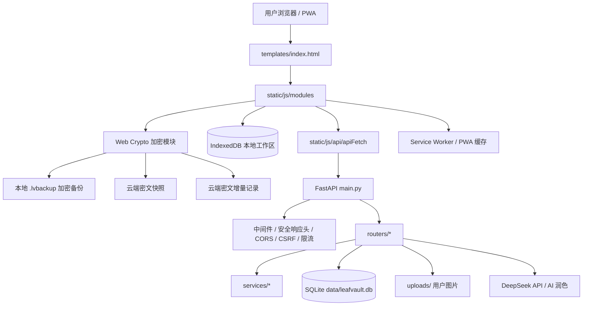
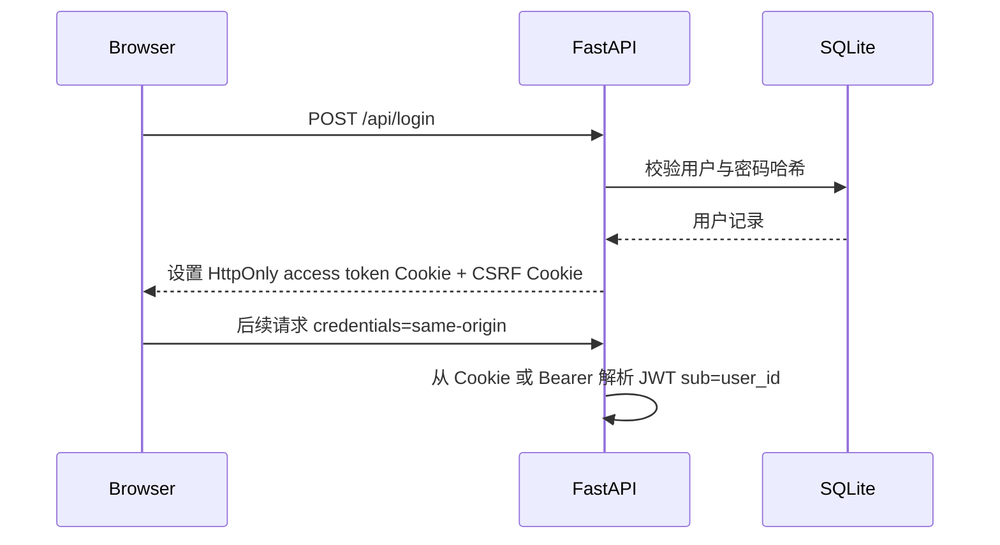
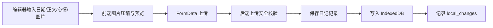
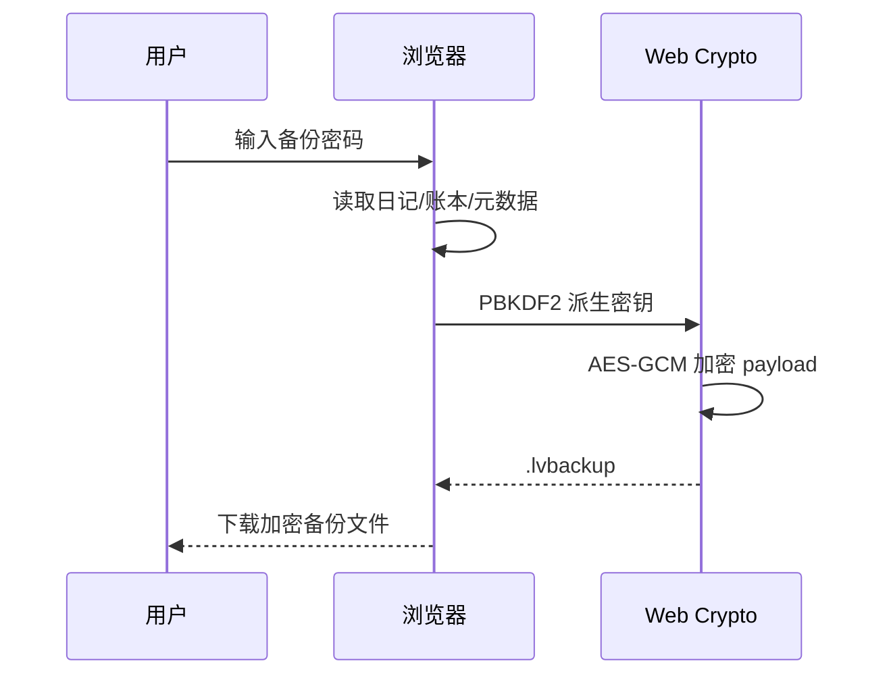
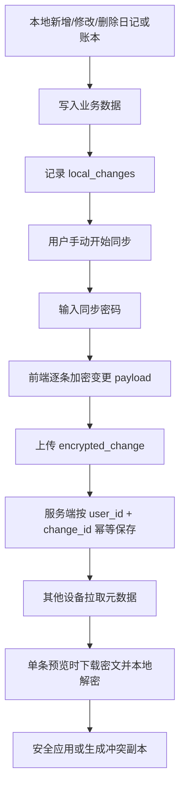
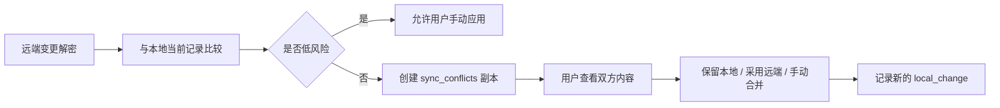
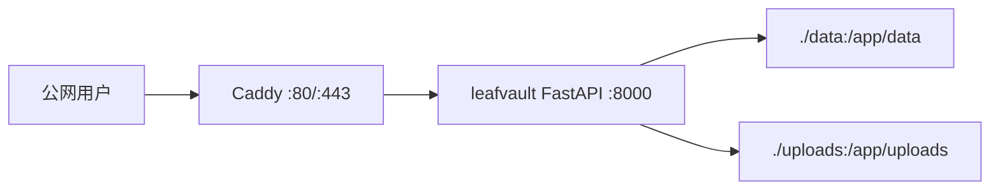

# LeafVault 架构说明

LeafVault 当前采用 **FastAPI + SQLite + 原生 JavaScript + IndexedDB + PWA + Web Crypto** 的组合，目标不是高并发多人平台，而是一个可本地优先使用、可自托管、可加密备份、可逐步演进到端到端加密同步的个人生活记录应用。

## 阅读索引

- 前端结构
- 后端结构
- 数据流
- 本地优先设计
- 加密备份设计
- 同步设计
- 认证设计
- 部署结构
- 架构限制

---

## 1. 架构定位

LeafVault v0.1 的核心定位是：

- **本地优先**：日记、账本和部分同步状态优先写入浏览器 IndexedDB。
- **服务端辅助**：服务端承担登录、用户隔离、图片上传、云端密文快照、增量密文记录和 AI 润色接口。
- **用户掌控备份**：用户可以导出本地 `.lvbackup` 加密备份，也可以上传云端密文快照。
- **自托管友好**：默认使用 SQLite 和本地 `uploads/`，适合个人 VPS 或小范围朋友使用。
- **安全渐进增强**：当前已支持 Cookie 优先、CSRF、上传校验、安全响应头和 CSP 基线；后续继续收紧 Cookie-only 和 CSP nonce/hash。

---

## 2. 总体架构图



简化理解：

```text
浏览器 IndexedDB = 本地主工作区
FastAPI + SQLite = 账号、索引、元数据和服务端能力
Web Crypto = 用户侧加密边界
uploads/ = 图片文件持久化目录
Docker + Caddy = 生产部署入口
```

---

## 3. 目录职责

### 3.1 前端

| 目录 / 文件 | 职责 |
| --- | --- |
| `templates/index.html` | 单页应用主模板，承载页面结构、移动端布局和基础入口。 |
| `static/js/api/` | 统一请求层，处理 `apiFetch`、Cookie、CSRF、错误提示和认证兼容。 |
| `static/js/modules/` | 业务模块，包括日记、账本、生活日历、备份、同步、PWA、UI 状态等。 |
| `static/service-worker.js` | App Shell 缓存、离线提示、PWA 更新提示；不得缓存 `/api/` 和敏感请求。 |
| `static/vendor/` | 本地化第三方库，减少运行时 CDN 依赖，配合 CSP 收紧。 |
| `static/css/` | 样式资源，后续继续减少内联样式，配合严格 CSP。 |

### 3.2 后端

| 目录 / 文件 | 职责 |
| --- | --- |
| `main.py` | FastAPI 应用装配入口，注册路由、中间件、静态目录和健康检查。 |
| `core/` | 配置、安全响应头、CSRF、认证依赖、限流、日志脱敏、上传校验等基础能力。 |
| `routers/` | 认证、用户、日记、账本、统计、备份、同步、AI 等 API。 |
| `services/` | 邮件验证码、图片处理、业务辅助服务。 |
| `db/` | SQLite 初始化、兼容迁移和表结构维护。 |
| `data/` | 生产 SQLite 数据库持久化目录。 |
| `uploads/` | 头像和日记图片持久化目录。 |
| `scripts/` | 质量门禁、部署预检、备份、恢复检查、静态安全检查等脚本。 |

---

## 4. 核心数据边界

LeafVault 的数据分为四类：

| 数据类型 | 存储位置 | 是否明文 | 说明 |
| --- | --- | --- | --- |
| 本地日记 / 账本工作数据 | IndexedDB | 浏览器本地明文或业务结构化数据 | 当前主工作区，用户清理站点数据会丢失。 |
| 服务端业务表 | SQLite | 当前 v0.1 仍保留必要业务数据 | 用于正式账号功能、图片引用、统计和兼容流程。 |
| 本地加密备份 `.lvbackup` | 用户下载文件 | 密文 | 由用户密码派生密钥，服务端不参与。 |
| 云端密文快照 / 增量 | SQLite | 密文 payload + 元数据 | 服务端保存元数据和密文，不解密用户内容。 |
| 上传图片 | `uploads/` | 图片文件本身 | 需要服务器级备份；后续可探索图片附件加密或对象存储。 |

需要明确：**v0.1 不是完全零知识架构**。它已经具备本地加密备份和云端密文同步工件，但为了保持当前日记、账本、图片和统计功能可用，服务端仍保留历史明文业务表。后续目标是逐步扩大密文同步和本地优先边界。

---

## 5. 认证与会话架构

### 5.1 登录流



### 5.2 当前策略

- 后端身份以 JWT `sub=user_id` 为准。
- 生产推荐 Cookie 优先。
- Cookie 模式写请求需要 `X-CSRF-Token`。
- Bearer fallback 仍保留，用于旧 PWA 缓存、本地调试和迁移兜底。
- 后续目标是 Cookie-only，并逐步移除 localStorage token 兼容。

### 5.3 安全边界

- 前端不能传 `user_id` 决定数据归属。
- 后端所有用户数据查询必须以当前登录用户为过滤条件。
- 错误响应不能暴露 token、CSRF、密码、密文 payload、数据库路径或 traceback。
- 生产必须使用 HTTPS，`COOKIE_SECURE=true`。

---

## 6. 日记与图片架构

### 6.1 日记保存流



### 6.2 图片上传安全

- 限制扩展名、MIME 和文件大小。
- 校验图片魔数，不只相信文件名。
- 后端重新生成文件名。
- 禁止 SVG、HTML、JS、EXE、PHP 等危险类型。
- 禁止路径穿越。
- 返回安全相对路径供前端展示。

### 6.3 图片持久化边界

`uploads/` 是生产数据的一部分，必须与 `data/` 一起备份。只备份 SQLite 不备份 `uploads/`，会导致日记图片和头像丢失。

---

## 7. 本地优先与 IndexedDB

IndexedDB 是 LeafVault 的本地工作区，用于增强移动端和 PWA 体验。

### 7.1 本地优先原则

- 网络异常时，尽量不阻断日记和账本本地记录。
- 本地数据变更会记录到 `local_changes`，用于后续增量同步。
- 云端更像备份和同步层，不是唯一数据来源。
- 用户仍需要定期导出 `.lvbackup` 或上传云端密文快照。

### 7.2 风险提醒

IndexedDB 依赖浏览器站点数据：

- 清理浏览器数据可能删除本地记录。
- 换浏览器或换设备不会自动带走本地数据。
- Demo 模式只保存在当前浏览器。
- PWA 不是原生 App，仍受浏览器存储策略影响。

---

## 8. 加密备份架构

### 8.1 本地加密备份



原则：

- 备份密码不保存到本地存储。
- 服务端不需要知道备份密码。
- 用户忘记密码后，备份无法恢复。
- `.lvbackup` 适合个人迁移和兜底恢复。

### 8.2 云端密文快照

云端快照流程：

1. 前端生成加密备份 JSON。
2. 上传到 `/api/sync/snapshot`。
3. 服务端保存 `encrypted_blob` 和非敏感元数据。
4. 列表接口只返回名称、备注、时间、大小等元数据。
5. 下载单条快照时才返回完整密文。

服务端不应解密、解析或记录快照明文内容。

---

## 9. 增量同步架构

增量同步围绕以下对象工作：

- `local_changes`
- `change_id`
- `device_id`
- `client_sequence`
- `encrypted_change`
- `sync_changes`
- `sync_conflicts`

### 9.1 增量同步流



### 9.2 同步边界

当前同步仍偏手动：

- 不做后台自动上传。
- 不做实时协作。
- 不做多人共享。
- 不让服务器解密内容。
- 不静默覆盖用户本地数据。
- 冲突需要用户明确确认。

### 9.3 元数据与密文分离

- 列表接口只返回元数据。
- 单条详情接口才返回密文 payload。
- 日志不能打印密文全文。
- 后端不能保存明文 preview。
- `user_id` 必须来自当前登录态。

---

## 10. 冲突处理架构

### 10.1 冲突原则

冲突处理的第一原则是：**宁可保留重复副本，也不要静默覆盖用户数据**。

### 10.2 冲突处理流



### 10.3 日记冲突

- 同一天日记按 `date` 识别。
- 正文并发修改不自动覆盖。
- 生成冲突副本，保留双方内容。
- 用户手动处理后再次记录新变更。

### 10.4 账本冲突

- 账本以 `uuid` 幂等。
- 新增流水通常可合并。
- 删除与修改冲突时优先保留证据。
- 删除应使用 tombstone，避免已删记录被其他设备重新同步回来。

---

## 11. PWA 与缓存边界

Service Worker 只应缓存 App Shell 和安全静态资源，不应缓存：

- `/api/` 请求。
- 登录、注册、重置密码请求。
- Authorization 请求。
- 云端快照密文。
- 增量同步密文。
- 用户上传请求。
- AI 润色请求。

PWA 更新应提供温和提示，避免旧缓存长期保留旧前端逻辑。涉及认证、同步和安全策略变化时，建议用户刷新或重新登录。

---

## 12. AI 润色架构

AI 润色是辅助功能，不是核心数据存储链路。

当前设计建议：

- 极速模式调用 `deepseek-v4-flash`。
- 深度模式调用 `deepseek-v4-pro`。
- `AI_API_KEY` 仅存在后端 `.env`。
- 前端不暴露真实 API Key。
- AI 请求不进入 Service Worker 缓存。
- 错误日志不记录完整日记正文。
- Demo 模式默认不调用真实 AI API。

---

## 13. 部署架构

推荐生产结构：

```text
LeafVault/
  docker-compose.prod.yml
  .env
  data/
  uploads/
  backups/
  deploy/
```

Docker Compose 生产结构：



部署原则：

- FastAPI 容器不要直接暴露 8000 到公网。
- 公网入口只走 Caddy/Nginx 的 HTTPS。
- `data/`、`uploads/` 和 `.env` 必须单独备份。
- Docker volume 不是备份。
- `.env` 不进入镜像，不提交 Git。

---

## 14. 质量门禁

发布前建议至少运行：

```powershell
python scripts/quality_gate.py
```

相关检查包括：

- 后端测试。
- 前端静态回归。
- 安全静态检查。
- PWA 缓存检查。
- Docker 配置检查。
- 移动端入口检查。
- 文档和部署预检。

手动验收仍不可省略，尤其是：

- 手机端真实浏览器。
- HTTPS Cookie session。
- 图片上传。
- 云端备份。
- 手动同步。
- PWA 添加桌面。
- 断网和弱网体验。

---

## 15. 架构限制

LeafVault v0.1 明确存在以下限制：

- SQLite 适合个人自托管，不适合大规模多人高并发。
- 同步仍偏手动，不做后台自动合并。
- 本地 IndexedDB 数据依赖浏览器环境。
- 图片文件依赖 `uploads/`，必须单独备份。
- Bearer fallback 仍在迁移期保留。
- 更严格 CSP 和 Cookie-only 仍在后续安全路线中。


---
