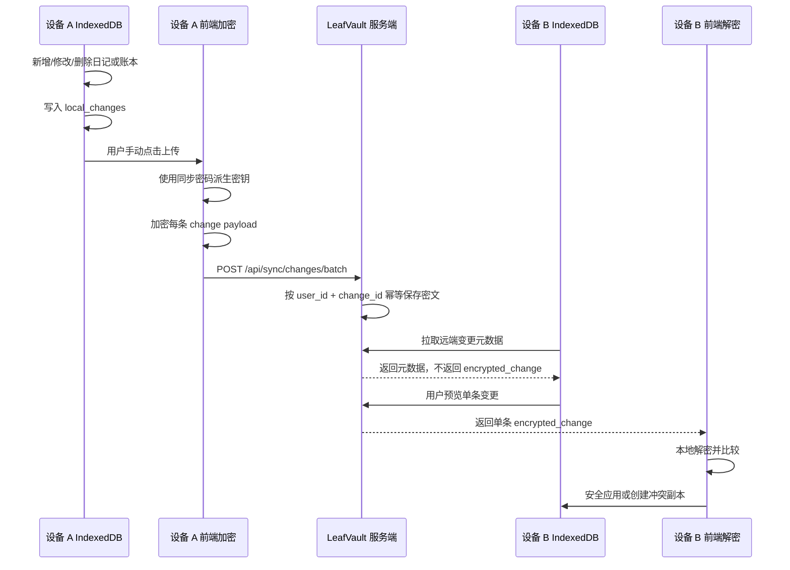

# LeafVault 端到端加密增量同步设计

本文定义 LeafVault 增量同步的设计边界、数据模型、加密边界、冲突策略和分阶段实施路线。

当前原则：**本地优先、用户手动触发、云端只保存密文、冲突不静默覆盖、服务器不解密用户内容**。

---

## 1. 设计目标

LeafVault 的增量同步需要服务于个人长期生活记录，而不是多人实时协作。设计目标如下：

1. **本地优先**  
   日记和账本优先写入 IndexedDB，网络不可用时仍能继续记录。

2. **离线可写**  
   离线新增、修改、删除都应被本地记录，等待用户后续手动同步。

3. **云端只保存密文增量**  
   服务端只保存前端加密后的变更记录和必要元数据。

4. **服务器不解密业务内容**  
   后端不接触日记正文、账本金额、分类、备注等明文业务细节。

5. **多设备最终一致**  
   不追求实时一致，而是通过手动上传、拉取、预览和应用逐步收敛。

6. **冲突不静默覆盖**  
   无法安全判断时必须保留双方版本或创建冲突副本。

7. **云端快照作为兜底**  
   增量同步复杂或失败时，完整云端密文快照和本地 `.lvbackup` 仍是恢复兜底。

---

## 2. 当前阶段边界

### 2.1 当前阶段做什么

- 记录本地变更日志。
- 支持手动上传 pending changes。
- 云端保存密文增量和元数据。
- 支持拉取远端变更元数据。
- 支持单条预览密文变更。
- 支持安全应用低风险变更。
- 支持生成冲突副本。
- 支持同步历史、失败重试和诊断入口。


---

## 3. 同步对象

首期同步对象：

| 对象 | 标识 | 说明 |
| --- | --- | --- |
| `diaries` | `date` | 一天一篇日记，包含正文、心情、图片引用等。 |
| `ledgers` | `uuid` | 单条账本流水，包含金额、分类、备注、日期等。 |

暂不纳入：

- 头像。
- 用户资料。
- AI 润色历史。
- 图片附件二进制内容。
- 系统设置。
- 云端快照本身。

图片附件后续应单独设计密文对象存储和引用关系，不建议直接塞入首期增量变更 payload。

---

## 4. 总体同步流程



---

## 5. 本地变更日志模型

IndexedDB 新增或维护 `local_changes` store，也可以理解为 sync outbox。

| 字段 | 类型 | 说明 |
| --- | --- | --- |
| `change_id` | string | 全局唯一 ID，建议 `crypto.randomUUID()`。 |
| `entity_type` | string | `"diary"` 或 `"ledger"`。 |
| `entity_id` | string | 日记用 `date`，账本用 `uuid`。 |
| `operation` | string | `"create"` / `"update"` / `"delete"`。 |
| `encrypted_payload` | string \| null | 上传前可为空，上传时临时生成或保存密文。 |
| `plain_preview` | null | 禁止使用，避免写入明文摘要。 |
| `base_revision` | number | 本地修改前版本号。 |
| `local_revision` | number | 本地修改后版本号。 |
| `device_id` | string | 当前浏览器设备 ID。 |
| `client_sequence` | number | 当前设备上的递增序号。 |
| `created_at` | string | 本地变更创建时间。 |
| `sync_status` | string | `"pending"` / `"syncing"` / `"synced"` / `"failed"`。 |
| `retry_count` | number | 重试次数。 |
| `last_error` | string \| null | 最近一次同步错误摘要，不能包含敏感 payload。 |

安全约束：

- `local_changes` 不能保存日记正文明文。
- `local_changes` 不能保存账本明细明文。
- 不使用 `plain_preview`。
- 错误摘要不得包含 token、密码、CSRF、密文全文或解密后的正文。
- 上传失败时可以保留状态和错误摘要，但不得保留同步密码。

---

## 6. 设备 ID 策略

`device_id` 用于排序、排查和冲突分析，**不是安全凭证**。

建议策略：

- 首次使用时生成 `crypto.randomUUID()`。
- 按用户分区保存，例如 `LeafVault_device_id_${userId}`。
- 不包含用户名、邮箱、真实设备名等隐私信息。
- 不参与鉴权。
- 不作为可信身份来源。
- 清理浏览器数据后可以重新生成。

---

## 7. 版本与顺序策略

仅依赖 `updated_at` 不可靠，因为设备时钟可能漂移，离线编辑和恢复备份也可能导致时间异常。

建议每条可同步记录维护：

| 字段 | 说明 |
| --- | --- |
| `local_revision` | 当前记录版本号，每次本地修改递增。 |
| `base_revision` | 变更基于的旧版本号。 |
| `updated_at` | 用户可理解的更新时间。 |
| `deleted_at` | 删除 tombstone 时间，避免被其他设备重新拉回。 |
| `device_id` | 最后修改设备。 |
| `last_change_id` | 最后应用的变更 ID。 |

判断原则：

- 日记按 `date` 唯一。
- 账本按 `uuid` 唯一。
- 删除使用 tombstone，不立即完全物理删除。
- 老数据缺少 revision 时可视为 `local_revision = 0`。
- 如果远端 `base_revision` 与本地当前 `local_revision` 不一致，需要进入冲突或安全合并判断。

---

## 8. 增量 payload 设计

### 8.1 明文 payload 进入加密前的结构

加密前 payload 只在前端内存中短暂存在，不应写入日志或长期存储。

示例：

```json
{
  "schema_version": 1,
  "change_id": "uuid",
  "entity_type": "diary",
  "entity_id": "2026-05-27",
  "operation": "update",
  "base_revision": 2,
  "local_revision": 3,
  "device_id": "device-uuid",
  "client_sequence": 18,
  "created_at": "2026-05-27T12:00:00.000Z",
  "data": {
    "date": "2026-05-27",
    "content": "日记正文",
    "mood": "calm",
    "images": ["/static/images/example.webp"]
  }
}
```

### 8.2 加密后上传结构

上传到服务端时应只包含密文和元数据：

```json
{
  "change_id": "uuid",
  "entity_type": "diary",
  "entity_id": "2026-05-27",
  "operation": "update",
  "device_id": "device-uuid",
  "client_sequence": 18,
  "base_revision": 2,
  "local_revision": 3,
  "created_at": "2026-05-27T12:00:00.000Z",
  "encrypted_change": {
    "version": 1,
    "kdf": "PBKDF2",
    "cipher": "AES-GCM",
    "salt": "...",
    "iv": "...",
    "payload": "..."
  }
}
```

服务端可以保存用于排序和筛选的元数据，但不能保存或生成明文摘要。

---

## 9. 加密边界

增量同步延续端到端加密思路：

- 前端在本地派生密钥。
- 前端在本地加密变更 payload。
- 后端只保存 `encrypted_change`。
- 后端不解密、不解析、不打印 payload。
- 同步密码或同步密钥不保存到服务端。
- 解密只发生在用户当前浏览器中。
- 云端密文快照仍作为完整恢复兜底。

### 9.1 密钥原则

当前阶段不引入复杂密钥托管：

- 用户每次同步时输入同步密码。
- 使用 PBKDF2 派生 AES-GCM 密钥。
- 密码不落盘。
- 派生出的 CryptoKey 不进入 localStorage。
- 页面刷新后需要用户重新输入同步密码。

后续可以单独设计“设备本地密钥缓存”或“恢复短语”，但不建议在 v0.1 阶段引入。

---

## 10. 服务端表设计

建议服务端维护 `sync_changes` 表。

| 字段 | 说明 |
| --- | --- |
| `id` | 自增主键。 |
| `user_id` | 当前登录用户 ID，来自 token，不来自前端参数。 |
| `change_id` | 全局唯一变更 ID。 |
| `entity_type` | `"diary"` / `"ledger"`。 |
| `entity_id` | 业务实体 ID。 |
| `operation` | `"create"` / `"update"` / `"delete"`。 |
| `encrypted_change` | 密文 JSON 字符串。 |
| `device_id` | 设备 ID，仅用于排序和排查。 |
| `client_sequence` | 设备内递增序号。 |
| `base_revision` | 变更基于版本。 |
| `local_revision` | 变更后版本。 |
| `created_at` | 客户端创建时间。 |
| `uploaded_at` | 服务端接收时间。 |

约束建议：

- `UNIQUE(user_id, change_id)` 保证幂等。
- 所有查询必须限定 `user_id`。
- 列表接口不返回 `encrypted_change`。
- 详情接口只返回当前用户自己的单条 `encrypted_change`。
- 日志只记录 `change_id`、`entity_type`、`entity_id` 和状态，不记录 payload 全文。

---

## 11. API 边界设计

### 11.1 批量上传

```text
POST /api/sync/changes/batch
```

职责：

- 接收一批密文变更。
- 校验数量上限和单条 payload 大小。
- 使用 `UNIQUE(user_id, change_id)` 幂等保存。
- 返回成功、重复、失败摘要。
- 不解密 payload。

### 11.2 元数据列表

```text
GET /api/sync/changes/metadata
```

职责：

- 返回远端变更元数据。
- 支持按 `since`、`device_id`、`entity_type` 过滤。
- 不返回 `encrypted_change`。
- 不返回其他用户数据。

### 11.3 单条详情

```text
GET /api/sync/changes/{change_id}
```

职责：

- 返回单条密文变更。
- 只允许当前用户访问自己的变更。
- 用于用户主动预览和应用。

### 11.4 同步清理

```text
POST /api/sync/changes/cleanup
```

职责：

- 清理已解决、过旧或用户明确确认删除的同步记录。
- 不删除 open conflicts、failed changes 或 pending changes。
- 需要明确确认，不做静默删除。

---

## 12. 上传流程

### 12.1 前端流程

1. 用户点击“上传待同步变更”。
2. 前端读取 `pending` / `failed` 的 `local_changes`。
3. 根据 `entity_type` 和 `entity_id` 临时读取本地业务记录。
4. 在内存中构建明文 change payload。
5. 用户输入同步密码。
6. 前端使用 PBKDF2 + AES-GCM 逐条加密。
7. 上传到 `/api/sync/changes/batch`。
8. 成功或重复的 `change_id` 标记为 `synced`。
9. 失败项标记为 `failed`，记录安全错误摘要。

### 12.2 后端流程

1. 解析当前登录用户。
2. 校验批量数量和单条大小。
3. 校验必要字段。
4. 使用 `UNIQUE(user_id, change_id)` 幂等写入。
5. 返回批量处理结果。
6. 不解密、不解析、不打印密文内容。

---

## 13. 下载与预览流程

### 13.1 拉取元数据

用户打开同步面板后，前端拉取远端元数据列表：

- 显示来源设备。
- 显示实体类型。
- 显示操作类型。
- 显示创建时间。
- 显示是否已在本地存在。
- 不显示正文、金额、备注等明文内容。

### 13.2 单条预览

用户点击单条预览时：

1. 前端请求单条密文详情。
2. 用户输入同步密码。
3. 前端在本地解密。
4. 解密后只在当前 UI 中展示。
5. 不把解密内容写入日志。
6. 用户选择应用、忽略或创建冲突副本。

---

## 14. 应用远端变更

远端变更应用前必须做安全检查：

| 检查项 | 处理 |
| --- | --- |
| 当前实体不存在，远端是 create | 可创建。 |
| 当前实体存在，远端 change_id 已应用 | 跳过，避免重复。 |
| `base_revision` 等于本地当前版本 | 可应用。 |
| `base_revision` 小于本地当前版本 | 进入冲突判断。 |
| 远端是 delete，本地已修改 | 生成冲突副本或 tombstone 冲突。 |
| 远端 payload schema 不支持 | 拒绝应用，提示升级版本。 |
| 解密失败 | 不应用，提示密码或数据错误。 |

应用成功后：

- 更新本地业务数据。
- 更新 `local_revision`。
- 记录 `last_change_id`。
- 记录同步历史。
- 如修改主数据，必要时生成新的 `local_change` 供后续上传。

---

## 15. 冲突策略

### 15.1 总原则

- 不静默覆盖。
- 不自动删除用户本地数据。
- 不把冲突当成错误隐藏。
- 用户应能看到双方差异。
- 手动解决结果要再次记录变更。

### 15.2 日记冲突

日记以 `date` 为唯一键。

可低风险合并的情况：

- 本地只改了心情，远端只改了图片。
- 本地追加图片，远端修改非正文元数据。
- 双方修改字段不重叠。

必须冲突处理的情况：

- 双方都修改正文。
- 一方删除，另一方修改正文。
- 双方基于不同版本修改同一字段。

冲突副本建议字段：

```json
{
  "conflict_id": "uuid",
  "entity_type": "diary",
  "entity_id": "2026-05-27",
  "local_snapshot": {},
  "remote_snapshot": {},
  "reason": "content_modified_on_both_sides",
  "status": "open",
  "created_at": "..."
}
```

### 15.3 账本冲突

账本以 `uuid` 幂等。

规则：

- 同一 `uuid` 不重复导入。
- 新增流水通常可直接合并。
- 修改和删除冲突时生成冲突记录。
- 删除使用 tombstone，避免其他设备重新导入。
- 金额、分类、日期、备注发生并发修改时不自动覆盖。

---

## 16. 同步历史与诊断

同步历史用于用户理解发生了什么，不用于保存敏感内容。

可以记录：

- 上传数量。
- 成功数量。
- 失败数量。
- 冲突数量。
- 操作时间。
- 来源设备 ID。
- 安全错误摘要。

不得记录：

- 日记正文。
- 账本金额和备注。
- 备份密码。
- 同步密码。
- token。
- CSRF。
- `encrypted_change` 全文。
- 解密后的 payload。

诊断报告导出也必须遵守同样规则。

---

## 17. 删除与清理策略

清理同步数据时要保守：

- 不删除 `pending`。
- 不删除 `failed`。
- 不删除 open conflicts。
- 不删除未确认的远端变更。
- 可以清理已解决冲突。
- 可以清理过旧的已同步历史。
- 可以限制每个用户保留的同步历史数量。
- 删除前应给用户明确提示。

服务端资源保护可结合：

- `MAX_SYNC_BATCH_SIZE`
- `MAX_SYNC_CHANGE_PAYLOAD_KB`
- 每用户同步历史数量上限
- 过期记录清理策略

---

## 18. 安全风险与防护

| 风险 | 防护 |
| --- | --- |
| 前端误存明文到 `local_changes` | 禁用 `plain_preview`，静态检查敏感字段。 |
| 后端日志泄露密文或正文 | 日志脱敏，不打印 payload 全文。 |
| 用户传入伪造 `user_id` | 后端只使用登录态中的 user_id。 |
| 重复上传导致重复应用 | `UNIQUE(user_id, change_id)` + 本地 `last_change_id`。 |
| 旧设备把删除记录重新拉回 | tombstone 删除策略。 |
| 同步密码遗忘 | 无法解密，只能重新选择其他恢复路径。 |
| 设备时间漂移 | 不只依赖 `updated_at`，使用 revision 和 sequence。 |
| PWA 缓存敏感响应 | Service Worker 排除 `/api/`、Authorization 和同步接口。 |
| 大量同步 payload 占满服务器 | 批量数量、单条大小、历史数量限制。 |

---


