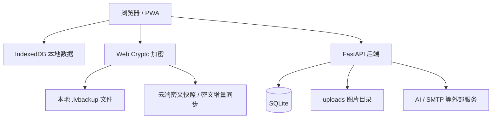

# LeafVault 项目概览

> 一个面向个人长期生活记录的本地优先 Web 应用。  

## 阅读索引

- LeafVault 是什么
- 为什么做这个项目
- 核心使用场景
- 项目当前阶段
- 当前限制

## 1. 项目定位

LeafVault 是一个将日记、图片、心情、账本、生活日历、备份与同步放在同一体验中的个人 Web 应用。


## 2. 为什么做 LeafVault

很多记录类工具体验很好，但数据往往被固定在某个平台中。LeafVault 希望探索一种更适合个人长期保存生活数据的方式：

- 平时可以像普通日记和账本应用一样轻量使用。
- 网络异常时，核心记录能力尽量不被阻断。
- 重要数据可以通过 `.lvbackup` 文件进行本地加密导出。
- 自托管服务器只保存账号数据、上传图片、云端密文快照和密文增量记录。
- 同步发生冲突时，不静默覆盖用户数据，而是保留冲突副本供用户手动处理。


## 3. 当前版本状态

目前已经具备：

- 登录、注册、验证码、邀请码或关闭注册的基础能力。
- 日记、图片、心情、置顶、补充更新和只读预览。
- 账本、分类、月度统计、生活日历和报表导出。
- 本地 IndexedDB 工作区和 PWA 基础体验。
- 本地 `.lvbackup` 加密导出与导入。
- 云端密文快照上传、下载、恢复和删除。
- 增量同步的本地变更日志、密文上传、远端元数据检查、单条预览和冲突副本。
- Cookie 优先登录态、CSRF 校验、Bearer fallback 兼容。
- Docker 自托管配置、Caddy HTTPS 反向代理示例和公网部署文档。
- 后端测试、前端静态检查、安全检查、PWA 检查、Docker 检查和文档检查组成的质量门禁。

仍在继续完善：

- 更严格 Cookie-only 模式。
- 更严格 CSP nonce/hash。
- 图片附件管理、搜索、标签和导出体验。

## 5. 核心功能

### 5.1 日记与生活记录

- 按日期记录日记。
- 支持文本、心情和图片。
- 支持追加图片和当日补充更新。
- 支持只读沉浸预览。
- 支持生活日历按日期回看。
- 支持移动端 PWA 使用体验。

### 5.2 账本与报表

- 记录收入与支出。
- 支持分类统计和月度统计。
- 支持按日历查看某天流水。
- 支持生活与财务摘要。
- 支持报表长图或 Excel 导出方向。

### 5.3 本地加密备份

- 用户输入备份密码。
- 前端使用 Web Crypto 进行加密。
- 浏览器下载 `.lvbackup` 文件。
- 备份密码不保存到本地存储。
- 适合个人迁移和兜底恢复。

### 5.4 云端密文快照

- 前端生成密文备份内容。
- 后端只保存密文 blob 和非敏感元数据。
- 列表接口只返回名称、备注、时间、设备和大小等信息。
- 下载单条快照时才返回完整密文。
- 达到快照数量上限时提醒用户清理旧备份。

### 5.5 增量同步

- 本地记录变化写入 `local_changes`。
- 用户手动触发同步。
- 每条变更由前端加密后上传。
- 后端只保存密文增量和必要元数据。
- 元数据列表不返回密文 payload。
- 单条预览时才下载密文并在本地解密。
- 冲突不会静默覆盖，会创建冲突副本让用户选择。

### 5.6 Demo 模式

- 不需要注册登录即可体验基础功能。
- Demo 数据只保存在当前浏览器 IndexedDB。
- Demo 不上传图片到服务器。
- Demo 不创建云端快照。
- Demo 不调用 AI API。
- Demo 不影响正式账号数据。

### 5.7 AI 润色

- 正式账号可使用 AI 润色。
- 普通润色可走快速模型。
- 深度润色可走更强模型。
- API Key 保存在服务端环境变量中，不进入前端。
- AI 功能不应成为日记保存的前置条件。

## 6. 技术栈

### 后端

- Python
- FastAPI
- SQLite
- httpx
- Docker

### 前端

- 原生 JavaScript
- Tailwind CSS 风格的响应式界面
- IndexedDB
- Web Crypto API
- Service Worker
- PWA Manifest

### 部署

- Docker Compose
- Caddy HTTPS 反向代理
- SQLite 文件持久化
- 本地 `uploads/` 目录
- `.env` / `.env.production` 环境变量配置

### 质量与安全

- pytest
- 静态质量门禁
- 安全响应头
- CORS / Trusted Host
- Cookie / CSRF
- 上传类型、MIME、魔数和大小校验
- 日志脱敏和敏感字段检查

## 7. 架构摘要

LeafVault 当前采用本地优先架构。



核心原则：

- IndexedDB 是用户日常记录的本地工作区。
- 服务器承担账号、云端备份、同步元数据和上传文件能力。
- 本地备份和同步密文由前端加密。
- 服务器不解密 `.lvbackup` 和增量同步 payload。
- 同步冲突不自动覆盖，由用户确认处理。
- SQLite 适合个人自托管，不作为高并发集群方案。

## 8. 安全边界


当前重点：

- 生产环境必须使用 HTTPS。
- `SECRET_KEY` 必须使用长随机字符串。
- Cookie session 优先，CSRF 强校验。
- `localStorage` token 仅作为迁移兼容方案。
- 上传图片必须经过后端校验。
- `.env`、数据库、上传目录、API Key 和邮箱授权码不能提交到 Git。
- PWA Service Worker 不缓存 `/api/`、认证请求和同步密文 payload。
- Demo 模式不占用服务器上传空间和 AI API 额度。

后续安全目标：

- 切换到 Cookie-only。
- 移除 Bearer fallback。
- 移除 `localStorage` token 兼容。
- 进一步收紧 CSP，逐步移除 `'unsafe-inline'`。
- 完善第三方库版本与完整性登记。
- 强化上传图片重编码和内容嗅探。

## 9. 部署方式

LeafVault v0.1 推荐通过 Docker Compose 部署到个人 VPS。

推荐目录结构：

```text
LeafVault/
  docker-compose.prod.yml
  .env
  data/
  uploads/
  backups/
  deploy/
```

其中：

- `data/` 保存 SQLite 数据库。
- `uploads/` 保存头像和日记图片。
- `backups/` 保存服务器级备份包。
- `.env` 保存真实生产配置，不能提交到 Git。
- `deploy/` 保存 Caddyfile 等部署配置。

公网部署推荐流程：

1. 本地运行质量门禁。
2. 准备真实 `.env`。
3. 运行生产配置预检。
4. 配置域名 DNS。
5. 使用 Caddy 处理 HTTPS。
6. 启动 Docker Compose。
7. 检查 `/api/health` 和 `/api/deployment/status`。
8. 完成人工功能验收。
9. 生成并下载服务器级备份。

## 10. 项目亮点

- **本地优先**：核心记录体验不完全依赖服务器。
- **加密备份**：用户可以主动导出 `.lvbackup` 文件。
- **云端只保存密文工件**：快照和增量同步 payload 不在服务端解密。
- **冲突不静默覆盖**：高风险同步冲突通过冲突副本保留。
- **移动端友好**：个人中心和同步管理区域针对手机端做了减负。
- **自托管清晰**：提供 Docker、Caddy、生产环境变量和部署预检。
- **安全工程意识**：把 Cookie/CSRF、上传校验、PWA 缓存和质量门禁纳入项目边界。
- **展示价值完整**：覆盖前端、后端、数据库、本地存储、加密、部署、测试和文档。

## 11. 当前限制

- SQLite 适合个人自托管，不适合大规模多人高并发。
- 图片文件依赖 `uploads/` 目录，需要部署者自己备份。
- 同步仍偏手动流程，不做后台自动合并。
- 图片附件增量同步仍需要后续单独设计。
- Cookie-only 和严格 CSP 仍在推进中。
- Demo 数据依赖浏览器本地存储，清理站点数据后可能消失。
- AI 润色依赖外部 API，可用性和费用受外部服务影响。

## 12. 文档导航

建议结合以下文档阅读：

- `README.md`：项目首页介绍和截图入口。
- `ARCHITECTURE.md`：架构、数据流和模块边界。
- `SECURITY_HARDENING.md`：生产环境安全加固基线。
- `PUBLIC_DEPLOYMENT.md`：公网部署配置和注意事项。
- `V0_1_RELEASE_CHECKLIST.md`：v0.1 发布前后验收清单。
- `INCREMENTAL_SYNC_DESIGN.md`：端到端加密增量同步设计。
- `DEMO_MODE.md`：Demo 模式边界说明。
- `OPERATIONS.md`：轻量运维和备份命令。
- `RESTORE_GUIDE.md`：服务器级备份恢复说明。
- `REGRESSION_TEST_PLAN.md`：回归测试计划。
- `SCREENSHOT_GUIDE.md`：README 和展示材料截图规范。
- `ROADMAP.md`：短期、中期和长期路线图。

